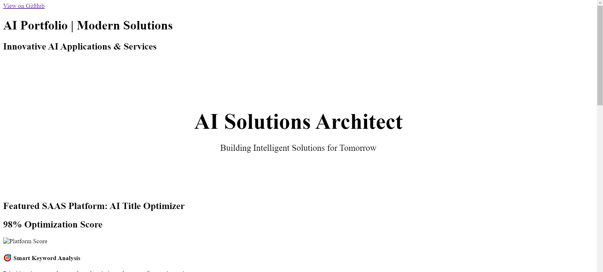

  <h1 style="font-size: 3.5em; margin-bottom: 20px;">AI Solutions Architect</h1>
  
Building Intelligent Solutions for Tomorrow

## Featured SAAS Platform: AI Title Optimizer

  

    <h2>98% Optimization Score</h2>
    

  

  
  
  
  

    

      <h4>🎯 Smart Keyword Analysis</h4>
      
Prioritizes important keywords and optimizes placement for maximum impact

    

    
    

      <h4>⚡ Real-time Optimization</h4>
      
Instant feedback and suggestions with detailed reasoning

    

    
    

      <h4>🔄 One-Click Replace</h4>
      
Seamlessly implement optimized titles with a single click

    

  

## Other AI Projects

  

    
    <h3>Advanced AI Chatbot</h3>
    
An intelligent conversational agent powered by state-of-the-art NLP models.

    <ul>
      <li>Multi-language support</li>
      <li>Context-aware responses</li>
      <li>Custom training capabilities</li>
    </ul>
    <a href="#" class="button">View Demo</a>
  

  

    
    <h3>AI Image Generator</h3>
    
Transform text descriptions into stunning visual artwork using AI.

    <ul>
      <li>High-resolution output</li>
      <li>Style customization</li>
      <li>API integration</li>
    </ul>
    <a href="#" class="button">View Demo</a>
  

## Technical Expertise

  
Python

  
TensorFlow

  
PyTorch

  
Flask

  
NLP

  
Machine Learning

  
Deep Learning

  
SAAS Development

  <h2>Let's Work Together</h2>
  
Have an AI project in mind? Let's make it happen!

  

    <a href="mailto:your.email@example.com" class="button">Email Me</a>
    <a href="https://linkedin.com/in/yourprofile" class="button">LinkedIn</a>
    <a href="https://github.com/yourusername" class="button">GitHub</a>
  

