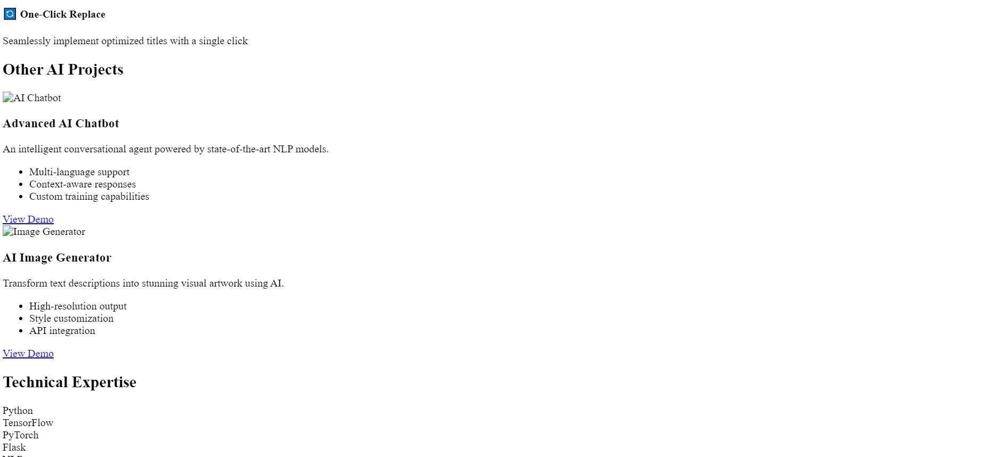

  <h1 style="font-size: 3.5em; margin-bottom: 20px;">AI Solutions Architect</h1>
  
Building Intelligent Solutions for Real-World Challenges

  

    <a href="#projects" class="button">View Projects</a>
    <a href="#contact" class="button">Get in Touch</a>
  

  <h2>About Me</h2>
  
I specialize in developing AI-powered solutions across various domains. From natural language processing to computer vision, I create applications that leverage cutting-edge AI technologies to solve complex problems.

  <h2>Featured Projects</h2>
  
  

    
    <h3>Advanced AI Chatbot</h3>
    
An intelligent conversational agent powered by state-of-the-art NLP models. Features include:

    <ul>
      <li>Multi-language support</li>
      <li>Context-aware responses</li>
      <li>Custom training capabilities</li>
      <li>Integration with popular platforms</li>
    </ul>
    <a href="#" class="button">View Demo</a>
  

  

    
    <h3>AI Image Generator</h3>
    
Transform text descriptions into stunning visual artwork using AI. Features include:

    <ul>
      <li>High-resolution output</li>
      <li>Style customization</li>
      <li>Batch processing</li>
      <li>API integration</li>
    </ul>
    <a href="#" class="button">View Demo</a>
  

  

    
    <h3>Predictive Analytics Platform</h3>
    
AI-powered analytics system for business intelligence. Features include:

    <ul>
      <li>Real-time data processing</li>
      <li>Predictive modeling</li>
      <li>Interactive dashboards</li>
      <li>Custom reporting</li>
    </ul>
    <a href="#" class="button">View Demo</a>
  

  <h2>Services Offered</h2>
  

    

      <h3>Custom AI Development</h3>
      
Tailored AI solutions for your specific needs

    

    

      <h3>AI Integration</h3>
      
Integrate AI capabilities into existing systems

    

    

      <h3>AI Consulting</h3>
      
Expert guidance on AI implementation

    

  

  <h2>Technical Expertise</h2>
  

    
Python

    
TensorFlow

    
PyTorch

    
Flask

    
Computer Vision

    
NLP

    
Machine Learning

    
Deep Learning

  

  <h2>Let's Work Together</h2>
  
Have an AI project in mind? Let's make it happen!

  

    <a href="mailto:your.email@example.com" class="button">Email Me</a>
    <a href="https://linkedin.com/in/yourprofile" class="button">LinkedIn</a>
    <a href="https://github.com/yourusername" class="button">GitHub</a>
  

